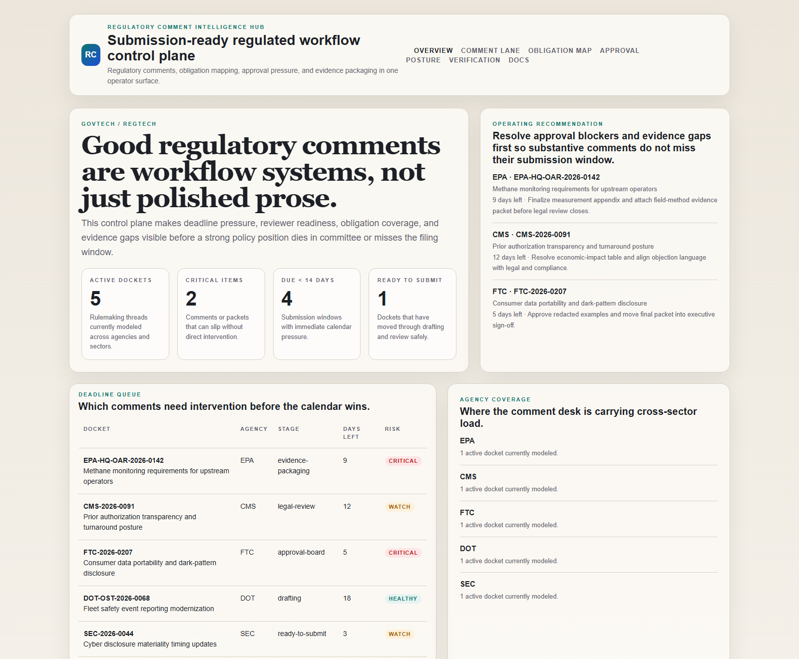
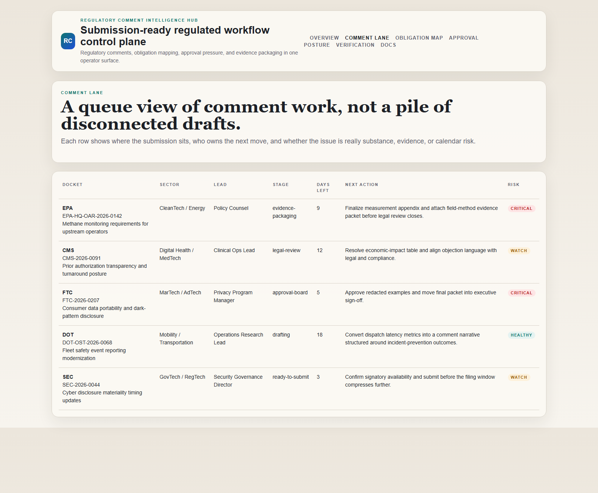
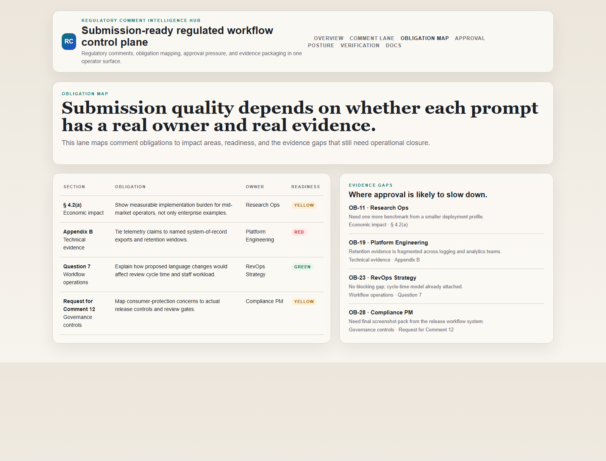
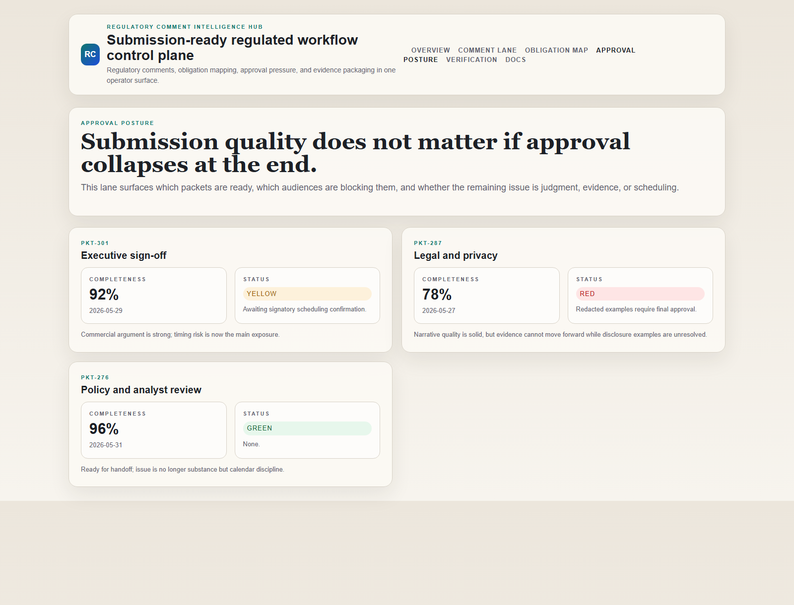

# Regulatory Comment Intelligence Hub

[](https://github.com/mizcausevic-dev/regulatory-comment-intelligence-hub/actions/workflows/ci.yml)
[](./LICENSE)
[](./.github/dependabot.yml)
[-lightgrey)](./fly.toml)

TypeScript control plane for regulatory comment intake, obligation mapping, approval posture, and evidence-packaged submission workflows.

## Why this exists

Regulatory commenting is often treated like a writing exercise when it is really a deadline-sensitive operating system:
- agencies publish prompts that splinter into legal, technical, operational, and commercial obligations
- evidence sits across teams that do not naturally work from one queue
- reviewers care about different risks, so strong substance still dies in approval traffic
- comment quality degrades when ownership, deadline pressure, and evidence gaps are not visible early

`regulatory-comment-intelligence-hub` models that operating layer so policy, compliance, legal, and executive teams can inspect where submission readiness is strong and where it is about to fail.

## Routes

- `/`
- `/comment-lane`
- `/obligation-map`
- `/approval-posture`
- `/verification`
- `/docs`

## API

- `/api/dashboard/summary`
- `/api/comment-lane`
- `/api/obligation-map`
- `/api/approval-posture`
- `/api/verification`
- `/api/sample`

## Screenshots






## Local Development

```powershell
cd regulatory-comment-intelligence-hub
npm install
npm run dev
```

Open:
- [http://127.0.0.1:5414/](http://127.0.0.1:5414/)
- [http://127.0.0.1:5414/comment-lane](http://127.0.0.1:5414/comment-lane)
- [http://127.0.0.1:5414/obligation-map](http://127.0.0.1:5414/obligation-map)
- [http://127.0.0.1:5414/approval-posture](http://127.0.0.1:5414/approval-posture)
- [http://127.0.0.1:5414/verification](http://127.0.0.1:5414/verification)

## Validation

- `npm run build`
- `npm run test`
- `npm run demo`
- `npm run smoke`
- `npm run render:assets`

## Production status

<!-- Maintained by Claude Code (Platform/SRE lane) after v1.0-prod hardening. -->

| Aspect | Status |
|--------|--------|
| CI | Node 20 + 22 matrix — lint · typecheck · coverage · build · demo · smoke · `npm audit` ([workflow](./.github/workflows/ci.yml)) |
| Test coverage | 100% statements on `src/services/` (gate: ≥ 60%) |
| License | [AGPL-3.0-or-later](./LICENSE) |
| Dependencies | Dependabot weekly (npm + GitHub Actions); `npm audit --audit-level=high` in CI |
| Security | [SECURITY.md](./SECURITY.md) — 0 known high/critical advisories at v1.0-prod |
| Deploy | Config staged ([fly.toml](./fly.toml) + [Dockerfile](./Dockerfile)); awaiting deploy credentials |

## Docs

- [Architecture](./docs/architecture.md)
- [Origin](./docs/ORIGIN.md)
- [Changelog](./CHANGELOG.md)
